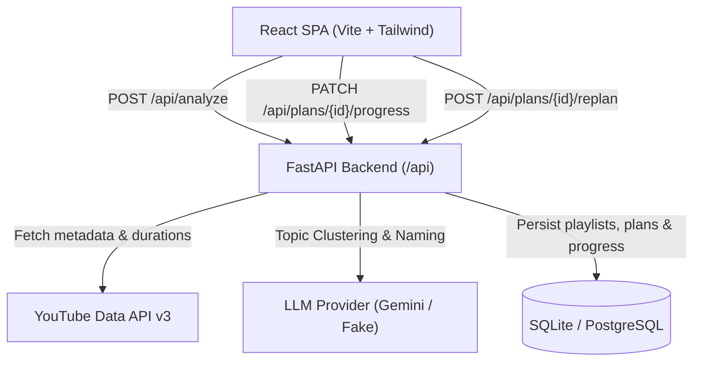

# StudyFlow: AI-Powered Study Planner for YouTube Playlists

> Paste a YouTube study playlist. Get a structured topic breakdown, realistic effort estimation, and weekly deadlines you can actually follow.

---

## The Problem

YouTube hosts exceptional free educational content, rivaling paid courses. However, learners face persistent organizational barriers: playlists offer no visibility into total study effort, no pacing structure, and no accountability. Students start with good intentions but quietly abandon courses when overwhelmed.

## The Solution

StudyFlow converts unstructured playlists into structured, guided curricula:
1. **Metadata Ingestion**: Fetches video titles, durations, and descriptions via the YouTube Data API v3 while filtering deleted/private videos and live streams.
2. **Topic Clustering**: Groups ordered videos into coherent topics using LLMs, sentence embeddings, or a hybrid approach.
3. **Realistic Effort Estimation**: Multiplies raw watch time by difficulty factors (1.25x – 2.0x) to account for pausing, note-taking, and hands-on practice.
4. **Deterministic Scheduling**: Packs topics into weekly blocks matching the student's available hours and target deadline without splitting topics unnecessarily.
5. **Dynamic Progress & Re-planning**: Tracks lesson completion and adaptively re-schedules remaining work when students fall behind or change pace.

---

## System Architecture



Detailed design notes: [Architecture Document](docs/architecture.md).

---

## Quickstart

### Prerequisites
- Python 3.11+
- Node.js 20+

### 1. Backend Setup
```bash
cd backend

# Create and activate virtual environment (optional)
python -m venv venv
# Windows:
.\venv\Scripts\activate
# Linux/macOS:
source venv/bin/activate

# Install dependencies
pip install -e ".[dev]"

# Configure environment
cp .env.example .env
# Set YOUTUBE_API_KEY and LLM_API_KEY in .env

# Run database migrations
python -m alembic upgrade head

# Run backend tests
python -m pytest

# Start development server
uvicorn app.main:app --reload --port 8000
```
Backend health check: `http://localhost:8000/api/health`

### 2. Frontend Setup
```bash
cd frontend

# Install dependencies
npm install

# Run frontend test scripts
node scripts/check-scheduler.mjs

# Build production bundle
npm run build

# Start development server
npm run dev
```
Open `http://localhost:5173` in your browser.

---

## Environment Variables

### Backend (`backend/.env`)

| Variable | Default | Description |
|---|---|---|
| `YOUTUBE_API_KEY` | *(required in prod)* | YouTube Data API v3 key |
| `DATABASE_URL` | `sqlite:///./studyflow.db` | Database connection URL |
| `CORS_ORIGINS` | `http://localhost:5173` | Allowed CORS origins |
| `LLM_PROVIDER` | `gemini` | `gemini` or `fake` |
| `LLM_API_KEY` | `None` | API key for the chosen LLM provider |
| `LLM_MODEL` | `gemini-1.5-flash` | LLM model identifier |
| `CLUSTERING_METHOD` | `llm` | `llm`, `embeddings`, or `hybrid` |
| `TARGET_TOPIC_HOURS` | `4.0` | Target watch time per topic |
| `EFFORT_MULT_BEGINNER` | `1.25` | Effort multiplier for beginner topics |
| `EFFORT_MULT_INTERMEDIATE` | `1.5` | Effort multiplier for intermediate topics |
| `EFFORT_MULT_ADVANCED` | `2.0` | Effort multiplier for advanced topics |
| `MAX_PLAYLIST_VIDEOS` | `500` | Maximum videos accepted per playlist |
| `PLAYLIST_CACHE_HOURS` | `24` | Cache retention for playlist metadata |
| `RATE_LIMIT_ANALYZE` | `10/minute` | Rate limit for analyze endpoint |
| `TESTING` | `False` | Enables offline testing with mocks |

### Frontend (`frontend/.env`)

| Variable | Default | Description |
|---|---|---|
| `VITE_API_URL` | *(empty = mock mode)* | Backend base URL (e.g. `http://localhost:8000`) |
| `VITE_USE_MOCKS` | `false` | Force mock mode regardless of backend URL |

---

## Running Tests

### Backend Test Suite
```bash
cd backend
python -m pytest
```
Runs 93 tests covering:
- Deterministic study scheduler (28 passing invariant tests)
- YouTube URL & duration parsing, pagination, filtering, quota handling
- LLM, embeddings, and hybrid topic clustering (with FakeLLM fallback & windowing)
- Effort calculation and video-to-week assignment invariants
- Progress calculation and adaptive re-planning

### Frontend Tests & Checks
```bash
cd frontend
node scripts/check-scheduler.mjs
npm run build
```

---

## Clustering Evaluation Tooling

To evaluate topic clustering methods (`llm`, `embeddings`, `hybrid`) on test playlists:
```bash
python scripts/eval_clustering.py --dry-run
```
Output report: [Clustering Evaluation Report](docs/clustering_eval_report.md).

---

## Deployment Guide

### Deploying Backend (Render / Railway)
1. Set build command: `pip install -e . && python -m alembic upgrade head`
2. Set start command: `uvicorn app.main:app --host 0.0.0.0 --port $PORT`
3. Configure environment variables in dashboard: `DATABASE_URL`, `YOUTUBE_API_KEY`, `LLM_API_KEY`, `CORS_ORIGINS`.
4. Health check endpoint: `/api/health`.

### Deploying Frontend (Vercel)
1. Framework preset: Vite.
2. Root directory: `frontend`.
3. Set environment variable: `VITE_API_URL` = your deployed backend URL.
4. `frontend/vercel.json` ensures client-side routing rewrites:
   ```json
   { "rewrites": [{ "source": "/(.*)", "destination": "/index.html" }] }
   ```

---

## Documentation Links

- [API Contract Specification](docs/api-contract.md)
- [System Architecture](docs/architecture.md)
- [User Guide](docs/user-guide.md)
- [Clustering Evaluation Report](docs/clustering_eval_report.md)

## License

MIT
